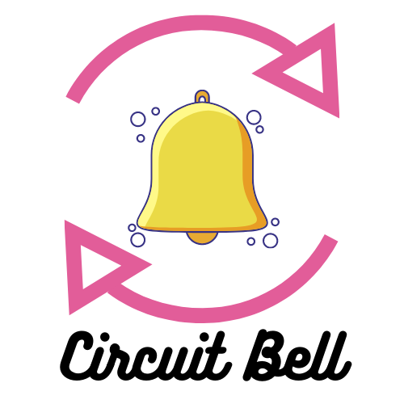

<!-- PROJECT LOGO -->
<br />
<p align="center">
  <a href="https://github.com/github_username/repo_name">
    
  </a>

  <h3 align="center">Circuit Bell</h3>

  <p align="center">
    Get notified for the products you love!
    <br />
    <a href="https://github.com/t-hnh10/circuit-bell"><strong>Explore the docs »</strong></a>
    <br />
    <br />
    <a href="https://github.com/t-hnh10/circuit-bell">View Demo</a>
    ·
    <a href="https://github.com/t-hnh10/circuit-bell/issues">Report Bug</a>
    ·
    <a href="https://github.com/t-hnh10/circuit-bell/issues">Request Feature</a>
  </p>
</p>

<!-- TABLE OF CONTENTS -->
<details open="open">
  <summary><h2 style="display: inline-block">Table of Contents</h2></summary>
  <ol>
    <li>
      <a href="#about-the-project">About The Project</a>
      <ul>
        <li><a href="#built-with">Built With</a></li>
      </ul>
    </li>
    <li>
      <a href="#getting-started">Getting Started</a>
      <ul>
        <li><a href="#prerequisites">Prerequisites</a></li>
        <li><a href="#installation">Installation</a></li>
      </ul>
    </li>
    <li><a href="#usage">Usage</a></li>
    <li><a href="#license">License</a></li>
    <li><a href="#contact">Contact</a></li>
  </ol>
</details>

## About The Project

Circuit Bell is a web scraper built with Python and Discord webhooks to notify users of product prices at pre-determined intervals.

Currently supports skincare products from [Stylevana](https://www.stylevana.com).

### Built With

* [Python](https://www.python.org/)
* [Beautiful Soup](https://www.crummy.com/software/BeautifulSoup/)
* [lxml](https://lxml.de/)
* [geckodriver](https://github.com/mozilla/geckodriver)
* [discord.py](https://github.com/Rapptz/discord.py)

## Getting Started

To get a local copy up and running follow these simple steps.

### Prerequisites
* Ensure you have Python 3 installed
* Beautiful Soup
  ```sh
  $ pip install beautifulsoup4
  ```

* lxml
  ```sh
  $ pip install lxml
  ```

* discord.py
  ```sh
  $ python3 -m pip install -U discord.py
  ```

* geckodriver: Download [here](https://github.com/mozilla/geckodriver/releases/) and place it in a directory such as `/usr/bin`.

* Firefox: Download [here](https://www.mozilla.org/en-US/firefox/new/)

### Installation

1. Clone the repo
   ```sh
   $ git clone git@github.com:t-hnh10/circuit-bell.git
   ```

## Usage

The program requires a list of URLs and Discord webhooks, for example:

```python
from discord import Webhook, RequestsWebhookAdapter

hada_labo_webhook = Webhook.partial(WEBHOOK_ID, WEBHOOK_TOKEN,\
 adapter=RequestsWebhookAdapter())

hada_labo_list = ['https://www.stylevana.com/en_AU/rohto-mentholatum-hada-labo-shirojyun-premium-whitening-lotion-170ml-moist-japan-version-170ml-random-delivery-on-packaging-3.html']
```

Import this file to the `main.py` file.

Run the following command to execute the program:
```sh
$ python main.py
```

Consider using a utility such as [cron](https://en.wikipedia.org/wiki/Cron) to set the intervals at which you would like to run this web scraper.

<!-- LICENSE -->
## License

Distributed under the MIT License.

<!-- CONTACT -->
## Contact

Tony Huynh - [@t_hnh10](https://twitter.com/t_hnh10) - huynh.tony55@gmail.com

Project Link: [https://github.com/t-hnh10/circuit-bell](https://github.com/t-hnh10/circuit-bell)
